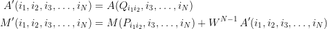

# Magic Hypercubes
(Last updated 2024-09-30 by Ron Burkey)

Background
----------

Many decades ago, my friend Brett was excited to show me a pencil-and-paper algorithm for generating certain types of magic squares.  A magic square, naturally, is a square array of distinct whole numbers in which each row, each column, and each diagonal adds up to the same total.  For example, here's a 4&times;4 magic square containing the numbers 0 through 15 in which each row, column, or diagonal adds up to 30:

     3  13  14   0
     8   6   5  11
     4  10   9   7
    15   1   2  12

Being an unfortunately naturally-dismissive person, I apparently said something to the effect of:  Yes, that's great, pal, but where you'd *really* have something would be if it could generate a magic *cube*.  Then, so the story goes, I came back the next day and showed him the magic cube I had constructed overnight.

Brett tells me he found this incident memorable, or at least memorable enough to remind me of it after 30+ years, though when he recounted it to me I'm sad to say I had no recollection of it.  It sounds like the kind of obnoxious thing I might have said and done back in the day.  Or today.  Still, it made me curious enough to look into the issue again, so as to reconstruct the method I must have used back then and indirectly, to inflict it on other people now.

I don't know what magic cube I showed Brett back then, but likely it was something like this 3&times;3&times;3 cube, in which each "row" (in any of the 3 dimension) adds up to 39:

    11  22   6      21   8  10       7   9  23
    25   0  14       2  13  24      12  26   1
     3  17  19      16  18   5      20   4  15

The "diagonals" also add up to 39, as long as you'll restrict your notion of what constitutes a "diagonal" only to those that pass through the center of the cube; i.e., those that pass through the cell containing the value 13.

<blockquote><b>Disclaimer:</b>  The original incident was long before the web (in the form it exists today), so we couldn't just have looked up "magic cubes" in some then-nonexistent search engine.  And <i>nowadays</i> I was just recreating this for fun, so I made a point to maintain my original level of ignorance and <i>not</i> to research it on the web.  So I'm sure that everything I have to say on the subject has been known for a very long time ... perhaps hundreds of years.  But I insist upon remaining uninformed.  In the likely event you know something about the topic, I beg you not to tell me about it.  Thanks for your cooperation!</blockquote>

However, the topic of this discussion is "magic *hyper*cubes", and not merely magic cubes.  A magic hypercube might exist in 4, 5, or indeed any number of dimensions, and not just the 2 or 3 dimensions in the examples above.

I'll discuss it with more nuance below, but the executive summary is this:

 * *N*-dimensional magic hypercubes of row-length *W* exist for every *N*>2 and every *W*>2 with *W*=(2*L*+1)2*K*, *L*&ge;0, *K*&ge;0, *K*&ne;1.
 * There is an algorithm for constructing such magic hypercubes.
 * A Python program is provided to perform the construction for given *N* and *W*

What this means is that magic hypercubes of dimension *W*&times;...&times;*W* always exist (and can be constructed) for *W* = 3, 4, 5, 7, 8, 9, 11, 12, 13, 15, 16, 17, ....  They definitely do *not* exist for *W*=2.  Whether they exist for *W* = 6, 10, 14, 18, ... I don't know.  My attempts to find them have failed.  I strongly suspect that *W*=6 does not exist. 

If we don't care about sums along the diagonals, then *all* widths exist except *W*=2 and (probably) *W*=6.

Definitions
-----------

Before saying anything more, I'll need to have some definitions to provide some clarity for the terminology I'll use.  Some of these definitions are standard, and some are my personal creations.

Definition:  By an *N*-dimensional *hypercube* of width *W*, I mean a *W*×*W*×...×*W* array of whole numbers.

Definition:  By a *stack* of a hypercube, I mean a row, column, or the analog of rows and columns in the other orthogonal directions.  In other words, a stack is any set of *W* cells of the hypercube that's parallel to an edge of the hypercube.

Definition:  By an *N*-dimensional *semi-magic hypercube* of width *W*, I mean a *W*×*W*×...×*W* array in which each of the values 0 through *W**N*-1 appears precisely once, and in which the sum of any stack is the same.  (Without consideration of the sums along the diagonals.)

Definition:  By a *diagonal* of a hypercube of width *W*, I mean a line of *W* elements (other than a stack) passing through the geometric center of the hypercube.  In other words, the elements from one corner of the hypercube to its antipodal corner.  A diagonal within (say) a face of a cube is *not* a diagonal of the entire cube, since it does not pass through the cube's center.

Definition:  By an *N*-dimensional *magic hypercube* of width *W*, I mean a semi-magic hypercube in which each of the hypercube's diagonals sum to the same value as the stacks.

Definition:  By an *N*-dimensional *latin hypercube* of width *W*, I mean I mean a *W*×*W*×...×*W* array containing only the values 0 through *W*-1 and in which any stack contains some permutation of the distinct values 0 through *W*-1.  No restrictions on the diagonals are implied.  The common term "latin square" is just a latin hypercube with *N*=2.

Definition:  A pair of latin squares *P* and *Q* is *mutually orthogonal* if the *W*2 ordered pairs (*P**ij*, *Q**ij*) formed from their elements are all distinct.  The phrase "mutually orthogonal latin squares" is abbreviated *MOLS*. 

Definition:  An *N*-dimensional magic hypercube is *associative* if the sum of any cell and the cell opposite to it across the square's center is the same.

Main Result
-----------

### General

Given a semi-magic hypercube of dimension *N*-1 and width *W*≠2, 6, there is a simple technique which can construct a semi-magic hypercube of dimension *N*, width *W*.  

This same technique can construct magic (as opposed to semi-magic) hypercubes of dimension *N* from magic hypercubes of dimension *N*-1, but only if the width *W* is:

* Any odd number >1; or
* A power of two > 2; or
* A product of any number of the above.

Software (magicLine.py) in the Python 3 programming language implements the construction technique.

### Algorithm for Adding a Dimension

For construction of an *N*-dimensional semi-magic hypercube *M'* of width *W* from an (*N*-1)-dimensional semi-magic hypercube *M*, the following additional arbitrary objects are required and must be supplied:

* An (*N*-1)-dimensional latin hypercube *A* of width *W*.
* A pair of mutually-orthogonal latin squares (MOLS) *P* and *Q* of width *W*.

The construction is as follows:

 .

(It's not actually necessary to insert *P**ij* and *Q**ij* at the *first* index of *A* and *M* as shown in the equations above.  It could have been done at any of the *N*-1 indices of *A* and *M*, as long as it is applied to the same index in both.  However, the first index is the most efficient in software implementations in the Python programming language.)

If in addition *M*, *A*, *P*, and *Q* are associative, then *M'* (and *A'*) are guaranteed to be associative as well. *M'* will then be magic (vs semi-magic).

### Algorithm for Constructing All Dimensions

A sequence of semi-magic hypercubes of increasing dimension can be constructed starting from the following 1-dimensional hypercubes *M*1 and *A*1 of width *W*, and successively applying the construction described above:

 .

If the MOLS *P* and *Q* are associative, then magic hypercubes are constructed; if not, then only semi-magic hypercubes can be guaranteed.

(Actually, any permutation of the values 0, 1, ..., W-1 can be used, and it needn't be the same permutation for *M*1 as for *A*1.  However, you can only hope to generate magic hypercubes vs semi-magic hypercubes if associative forms of *M*1 and *A*1 are used.)

### Flies in the Ointment

Just to be absolutely clear, I don't pretend to provide MOLS.  I've simply used borrowed knowledge about them.  

The principal difficulty in performing the construction described above is that one must have mutually-orthogonal latin squares (MOLS) *P* and *Q* to perform it, and preferably associative ones in order to insure production of magic hypercubes vs semi-magic hypercubes.

But each width *W* naturally requires different MOLS *P* and *Q*, and there's not always a known way (or sometimes even any way at all) to find them.

Here's a summary of what I think is the current state of mathematical knowledge regarding MOLS:

* MOLS of width *W*=2 and *W*=6 are known *not* to exist.
* MOLS of all widths *W*>2 but ≠6 are known to exist.
* Associative latin squares (and therefore MOLS) of width *W*≡2 mod 4 are known not to exist.
* Algorithmic techniques for constructing associative MOLS are known when *W* is:  any odd number *W* > 1; any power of two > 2; or any product thereof.  Let's call this set of widths *W**S*.
* Algorithmic techniques for constructing (non-associative) MOLS are known when *W* is:  equal to *q*+*r*, where *r* is odd, *q*=2*r*+1, and *q* is not divisible by 3; any product thereof with any of width ∈*W**S*.  Let's call this set of widths *W**N*.
* About a dozen (non-associative) pairs of MOLS for widths not covered by the above (*W*=14, 18, 22, ...) have been found in the mathematical literature or supplied by running SageMath software.  (Non-associative) MOLS for any width *W* that's a product of these, or a product with an width ∈*W**S* ∪*W**N*, are also known.

It is difficult to tell at a glance, obviously, but there are gaps in the list above.  I.e., there are widths *W* for which MOLS are known to exist, but for which I have not supplied the effort necessary to support them in the provided magic-hypercube construction software.  Those gaps in software support at this writing are:

*W* = 122, 134, 146, 158, 166, ... .

Thus all widths *W* < 100 are supported by the software, except for the impossible widths 1, 2, and 6, but the coverage becomes more spotty at larger widths.

Some Sample Magic Cube Constructions
------------------------------------

3×3×3:

4×4×4:

5×5×5:

    
6×6×6:  Impossible.

7×7×7:

    
8×8×8:

Some Sample Magic Hypercube Constructions
-----------------------------------------

3×3×3×3:

    
4×4×4×4:

    

Installing and Using the Software
---------------------------------

To use the provided software, install Python 3 if not already installed, then download magicLine.py and hardcodedMOLS.py onto your local computer (in the same folder as each other), perhaps putting them somewhere in your PATH.

The actual code for constructing an (*N*+1)-dimensional magic hypercube from an *N*-dimensional one is just the function ``constructDimension()`` which is only about 40 lines long.  The remaining thousands of lines of code are for constructing the MOLS *P* and *Q*, double-checking results, engineering test cases that I should probably remove, and so on.

Example usage:  The command

    magicLine.py --width=5 --dimension=7

would construct, double-check, and display magic hypercubes of geometries 5×5 (i.e., a magic square), 5×5×5, 5×5×5×5, 5×5×5×5×5, 5×5×5×5×5×5, and 5×5×5×5×5×5×5 in a somewhat human-readable form.  

Adding the command-line switch ``--python`` would cause the hypercubes to be printed as Python arrays instead of the supposedly-humanly-readable form.

Adding the command-line switch ``--partial`` (for semi-magic cubes) does not alter the construction in any way, but simply avoids checking the sums of the diagonals of the constructed hypercubes.

Adding the command-line switch ``--quiet`` prevents printing out monstrously-huge hypercubes, while still seeing messages indicating success or failure of the construction.  Useful for tests with larger *W* and/or higher dimensions.

Adding the command-line switch ``--debug`` causes additional tests to be performed and messages relating to them to be printed.

Adding the command-line switch ``--max-memory=G``, where ``G`` is a floating-point value in gigabytes, tells the program to abort if its predicted memory usage will exceed ``G`` gigabytes (default is 4.0).  It won't save you from entering a monstrous width like *W*=1000000, but it's very useful for "small" widths like 200.  Mainly, it means that you can set ``--dimension`` very high with some confidence that it will compute as many dimensions as it can but gracefully exit before wasting a lot of time on a dimension it just doesn't have the resources for.

